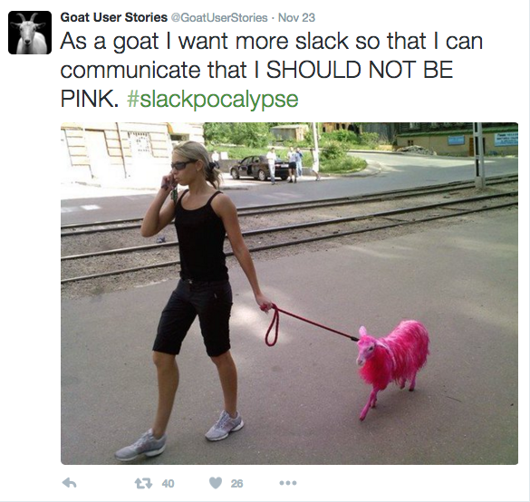
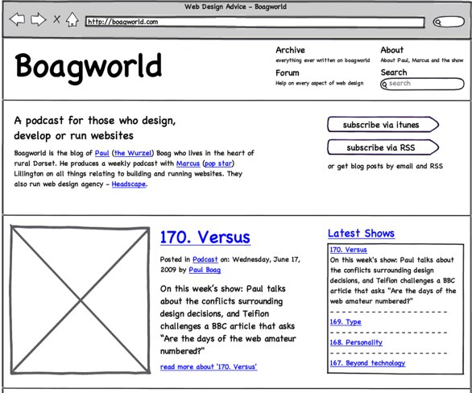

#How to Plan and Start Your Project
*With big thanks to [Christina Koller](http://www.github.com/cmkoller), who wrote the initial version of this talk, which I have largely kept.*

##Make a "dream list" and a "do it now" list

When planning your app, you're going to have a lot of big crazy awesome ideas - which is super fun. Store those ideas somewhere. Every time you think of a new feature, write it down on that "dream features" list.

For actually starting, you need to pick a very small, core subset of those features and NOT let yourself develop beyond that until those starting features are all meeting your expectations. For our purposes, this will typically only be one or two models and some basic CRUD functionality for them.

Once you have your "dream list" fleshed out with all the ideas that have been floating around in your head, ask yourself what the core functionality of your app is. If you chip away as many pieces of your app as possible, what are you left with? That's what you should start with.

###Think Lean & A Brief Interlude on Not Getting Lost in the Weeds
As an aside to the topic of planning a project, one major school of thought in the software industry is that of Lean software development. Lean philosophy has 7 principles:

*Eliminate waste
*Amplify learning
*Decide as late as possible
*Deliver as fast as possible
*Empower the team
*Build quality in
*See the whole

It's important to be familiar with these principles, since many teams that you may work on in the near future will use them to guide development. Lean is particular relevant in startups and small to mid-size companies where bootstrapping and quick iteration are key in time to market and survival.

Eliminating waste is most applicable to your situation with building a small app to show your skills in a dramatically compressed sprint of two weeks. You provide enormous value to both yourself in this scenario but also in the future to a company when you know how to drill down what is absolutely necessary to create a feature and do not get mired in the weeds of unnecessary optimizations and gold-plating. For example, if you are trying to create a user interface that allows someone to send an invite to another user to join their "team," the first solution that comes to your mind should not be an auto-filling form that leverages a React.js module to provide instant feedback on the page. It's awesome if you add this later, but the minimum thing you need to do is make a form that takes an email address, and then do some logic to send an invite. Focus on the minimum amount of code to get the job done, and then later flesh out that skeleton with beautiful interface touches and thoughtful integrations.

Anecdotally, every cohort there are a few students who get stuck on some nice-to-have feature while working on their app. Maybe they are trying to use a new gem with difficult documentation or they get hung up on a styling issue for their homepage. In any event, these detours become costly when pursued for the better part of a day in a two-week period. You should prioritize what is absolutely needed to make your app do what you say it will do, and nothing more until that is accomplished.

One great way to stay Lean is to practice "time boxing." This means that you will set aside a maximum amount of time to pursue a non-core problem, and then move on if you cannot solve the problem in that amount of time. A good time box is about 30 minutes to an hour. Just like we encourage you to ask us for help when you get stuck for 15 minutes or more, you shouldn't spin your wheels on something for so long that your overall productivity suffers.

##ER Diagrams

Every project should begin with an ER Diagram. You need to understand what objects or tables you need, and how they relate to one another. A quick reminder on how to do this:

Draw a box for each table you plan on having in your database
Inside each box, write the name of the database table, and list each column name you plan on having in the table
Draw lines between the tables that are connected to each other. (I.e, the character table and a table that has a column for character_id are connected.)

Possible tools:

[Google Drawings](https://support.google.com/docs/answer/179740?hl=en)
[Draw.io](https://www.draw.io/) (free and... ok)
[Lucidchart](https://www.lucidchart.com/) (nicer but not free, 30-day free trial)
Whiteboard and Photo, or Pen and Paper (my preferred methods)

This is very important: Your ER diagram should represent the current (or very-soon-to-be) reality of your database schema. This is your do-it-now list. DO NOT go creating tables like crazy just because you thought of them. (I will make you delete them. Seriously.) The ONLY time to create a table in the database is when your current feature test calls for it.

Optionally, you can make a second ER diagram as a "dream ER diagram" to house all your future thoughts and dreams about the database schema. This is fun to have and fun to make, but is of much lower priority than the "reality" diagram and basically just serves as another dump-point for all your ideas, so you can come back to them when the time comes.

3. User Stories and Acceptance Criteria

Now that you have a general idea for a core starting point, time to hash out what exactly that means. One common approach is to make a user story and set of acceptance criteria for each feature you plan on developing. You're familiar with these from your last couple of long-form challenges, but a reminder on how to write them:

User Stories:

User stories describe what value a feature brings to a user. The idea is to not go into implementation details at all, just keep it very general and based on what the user wants to accomplish by using the feature. They are structured like this:

As a... <some kind of user of your site>
I want to... <do something with your site>
So that... <some user goal is achieved>
Here are a couple examples:

As a user
I want to submit links to my favorite songs
So that I'm able to share my awesome music finds with my friends.

As a user
I want to see a list of favorite songs submitted by my friends
So that I'm able to discover new good music that's been vetted by my friends.

As an admin
I want to delete a song off of the list of favorite songs
So that I'm able remove inappropriate content.
Acceptance Criteria:

User stories don't go into implementation details - **that's what acceptance criteria are for**. This is a list of implementation details that you consider necessary for a feature to be considered complete. Usually, each user story has a set of acceptance criteria to further describe it. Example:

As a user
I want to submit links to my favorite songs
So that I'm able to share my awesome music finds with my friends.

[ ] I can visit "/songs/new" and view a form to submit a new song
[ ] I must fill out "Title", "URL", and "Rating" to submit a new song
[ ] I can optionally fill out "Description" when submitting a new song
[ ] "Rating" must be a number between 1 and 5
[ ] If any required fields aren't properly filled out when I try to submit the form, I get a descriptive error message and remain on the page.
[ ] If I submit a successfully filled-out form, I get redirected to "/songs" and can see my new song on the list.
These will help guide your test-writing down the line.

4. [Optional] Wireframing

Now that you have an idea of what pages and features you'll have for starters, it can be helpful to sketch out what you want the pages to look like. This isn't always necessary - often you'll have a fine time just visualizing it in your head or making up the page layout as you go along. However, some people always like to wireframe, and for particularly complicated pages it can be very useful.

Balsamiq is one tool you can use to easily create page layouts! There are others too, and you can also just sketch them by hand. They don't need to be beautiful, just show generally where things should fall on the page.

5. Write ONE Feature Test

You will stress yourself out and lose clear sight of your direction if you go writing all your feature tests at once. Pick out one feature (one user story, one set of acceptance criteria) and start with that. For the first thing, I like to put my user story and acceptance criteria straight into my test:

# /spec/features/user_submits_new_song_spec.rb

require 'spec_helper'

feature "User submits new song", %(

  As a user
  I want to submit links to my favorite songs
  So that I'm able to share my awesome music finds with my friends.

  [ ] I can visit "/songs/new" and view a form to submit a new song
  [ ] I must fill out "Title", "URL", and "Rating" to submit a new song
  ...
  ...

%) do

  # scenarios go here

end
This way, I can actually check off my acceptance criteria as we go. Do note that every acceptance criteria should end up being tested but we do not need a separate acceptance criteria for each test. As long as your tests wouldn't pass if an acceptance criteria was not being fulfilled, we're okay.

Now it's time to actually write the tests!

Start by just writing one scenario. You can flesh out what you want the other ones to be by writing them into the file, but leave them empty for now.

6. TDD off into the sunset

Let your tests drive the development of your feature! Early on you'll run into the problem that you don't currently have a table set up in your database, but let the tests tell you when to create that. Once you do hit that point, make unit tests for that model first, especially once we get to ActiveRecord.

Workflow should go:

"Oh, my tests say I don't have that table set up yet. That makes sense, since I don't."
"Let's write some unit tests to test-drive my creation of that model."
*...tdd model via unit tests...*
"Yay, now I have my model, let's see what the next error is in my feature test"
7. Pick a new user story, and do it again!

Self-explanatory.
